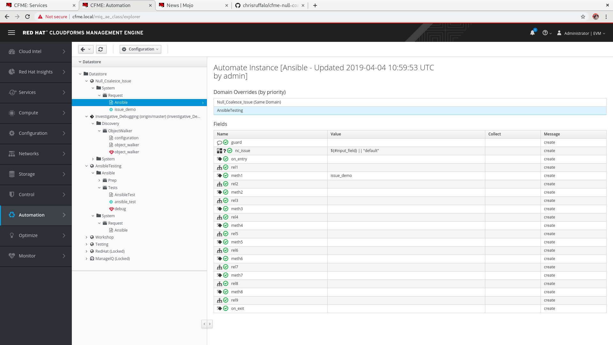
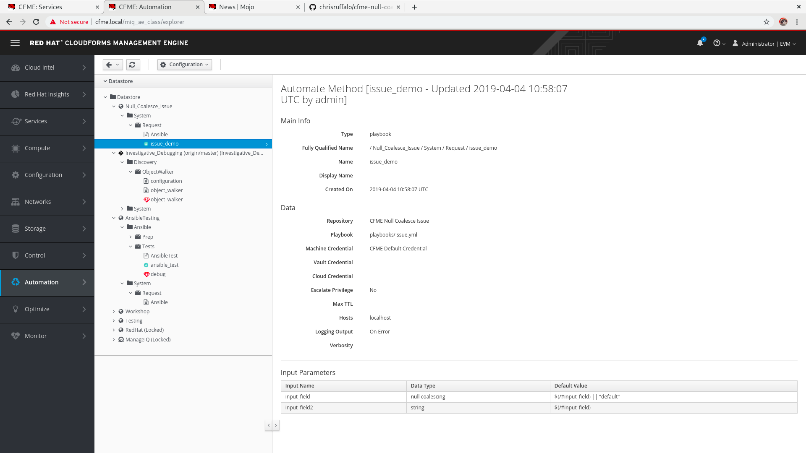
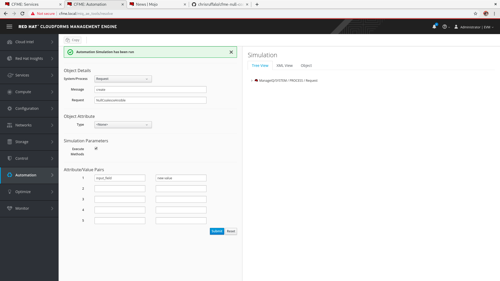
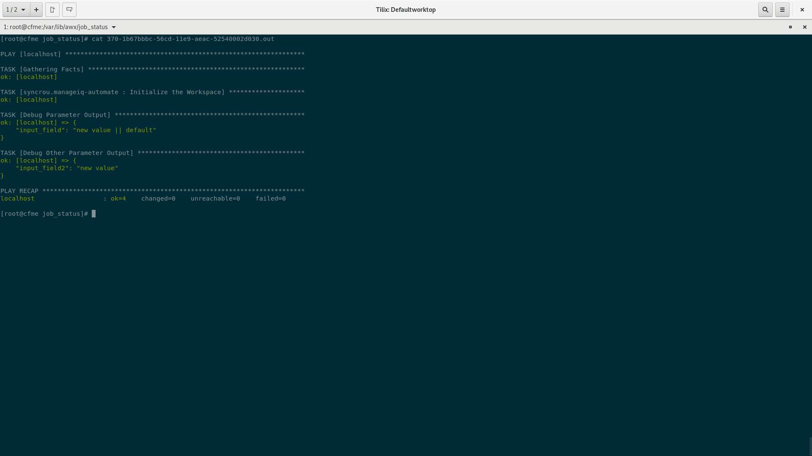

# CMFE Null Coalescing Fields in Ansible Methods

## To reproduce this issue
* Import https://github.com/chrisruffalo/cfme-null-coalesce-issue.git as an Ansible repository with the EXACT name "CFME Null Coalesce Issue"
* Import https://github.com/chrisruffalo/cfme-null-coalesce-issue.git as a Domain from the branch origin/master
* Simulate the execution of `NullCoalesceAnsible` with the attribute/value pair { input_field => new value }
* Observe the output of `input_field` is 'new value || default' while the ouput of `input_field2` is just 'new value' (because it was coalesced inside the instance)

## Screenshots

The automation instance has a new member added (`nc_issue`) that is used to null coalesce the input `input_field` from the simulation.

The plabook method has two inputs, one which is null coalesced in the field and another that accepts the value (`nc_issue`) that was coalesced in the instance

The simulation passes in a new value, ommit `input_field` to have it print the value "default"

Expected output would have `input_field` and `input_field2` the same value

This is the output when no value is given in the simulation, both `input_field` and `input_field2` should have the same value

