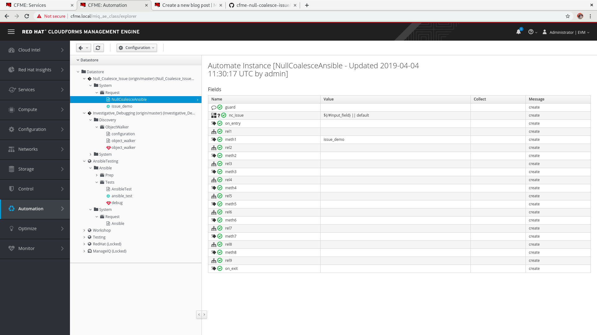

# CMFE Null Coalescing Fields in Ansible Methods

## To reproduce this issue
* Import https://github.com/chrisruffalo/cfme-null-coalesce-issue.git as an Ansible repository with the EXACT name "CFME Null Coalesce Issue"
* Import https://github.com/chrisruffalo/cfme-null-coalesce-issue.git as a Domain from the branch origin/master
* Simulate the execution of `NullCoalesceAnsible` with the attribute/value pair { input_field => new value }
* Observe the output is 'new value || "default"'

## Screenshots

